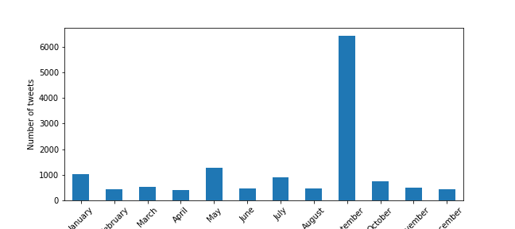

# Netizen Thought Analysis
Thought analysis against a community (ahmadiyya community in Indonesia) in the social media (twitter) in 2021.

## Project Overview
+ Analysing public opinion about the community to help the community prepare and improve future programs
+ Scraped 15k+ social media post samples from twitter using python and selenium
+ Extracted insights about the topics, sentiment, and tweets distribution throughout the year

## Resources
**Python** version 3.9 \
**Packages:** pandas, selenium, langdetect, matplotlib, seaborn, json, tqdm, scikit-learn \
**Twitter Scraper Github:** https://github.com/iddzzz/twitter-scraper \
**Indonesian Stopwords:** https://github.com/stopwords-iso/stopwords-id

## Web Scraping
Scraped 15000+ tweets from twitter.com. With detail of:

+ Name
+ Username
+ Date
+ Reply to
+ Tweet content
+ Number of replies
+ Number of retweets
+ Number of likes

## Data Cleaning
Cleaned data for further analysis. I did the following tasks:
+ Removed advertisements
+ Removed tweets with languages other than Indonesian
+ Removed mentions and links
+ Transformed values each column into appropriate data type
+ Imputed null values

## Exploratory Data Analysis

### Top 10 Users by Number of Tweets

|    | initial   |   tweet |   reply |   retweet |   like |
|---:|:----------|--------:|--------:|----------:|-------:|
|  0 | Mur       |     828 |     668 |        86 |    124 |
|  1 | Ded       |     318 |      82 |       271 |    791 |
|  2 | bil       |     298 |       0 |         0 |      0 |
|  3 | Ahm       |     214 |     187 |      2453 |   2615 |
|  4 | Ima       |      99 |      30 |        50 |    124 |
|  5 | IG:       |      81 |       1 |         1 |     25 |
|  6 | نان       |      63 |      28 |        27 |     51 |
|  7 | Nas       |      55 |      24 |        75 |    183 |
|  8 | Aph       |      54 |       9 |         3 |     12 |
|  9 | iLb       |      54 |      49 |         2 |      6 |

The top 10 users normally attract other netizens to interact, except for 'bil' and 'IG:', which might be buzzer account.

### Tweets over the year

There are 4 months with significant number of tweets, especially September 2021. They correspond to the occurences: Sintang incident (Sep).

## Clustering Result

### Topic Categories

Coming soon ...